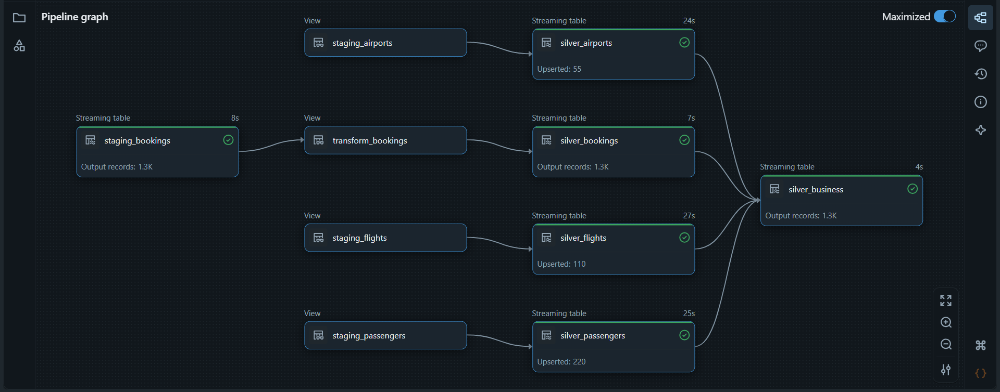

# ✈️ Flights Data Pipeline with DLT & Databricks

[](https://deepwiki.com/PriyanshuCodes24/flights-dbt-dlt-pipeline)

A production-style, end-to-end **data engineering platform** built on **Databricks** using **Delta Live Tables (DLT)**, **Auto Loader**, and **Delta Lake**.  
This pipeline demonstrates transforming raw flight booking data into a governed, analytics-ready **star schema** using a scalable **Medallion Architecture (Bronze → Silver → Gold)**.

This project showcases **modern data engineering practices** including incremental ingestion, data quality enforcement, CDC handling, orchestration, and dimensional modeling.

---

## 🧭 Pipeline Architecture

The pipeline follows the **Medallion Architecture**, progressively refining data from raw files to analytics-ready tables:

### Data Flow by Layer

1. **Staging Layer**  
   Raw CSV files for `bookings`, `flights`, `passengers`, and `airports` land in the staging schema.

2. **Bronze Layer — Raw Ingestion**  
   - Incremental ingestion using **Databricks Auto Loader**  
   - Idempotent and schema-aware  
   - Malformed records captured in `_rescued_data`  
   - Orchestrated via **Databricks Workflows**

3. **Silver Layer — Cleansed & Conformed**  
   - Data quality expectations to drop invalid rows  
   - Type casting & normalization  
   - **SCD Type 1 CDC** on dimensions using `create_auto_cdc_flow`  
   - Produces trusted Silver tables
   - ### Silver Layer Pipeline Overview


4. **Gold Layer — Analytics Data Mart**  
   - Dimension tables with surrogate keys  
   - Incremental merges  
   - Star schema modeling  
   - Fact table joins Silver data with Gold dimensions
---

## 🧱 Key Technologies

| Category | Technology |
|---------|------------|
| Platform | Databricks |
| Storage | Delta Lake |
| Ingestion | Auto Loader (`cloudFiles`) |
| Transformations | PySpark |
| Streaming & Quality | Delta Live Tables |
| CDC | DLT `create_auto_cdc_flow` |
| Orchestration | Databricks Workflows |
| Modeling | Dimensional (Star Schema) |

---

## Project Structure

```
.
├── BronzeLayer_DynamicSolution.ipynb  # Orchestrated notebook for Bronze ingestion
├── BronzeLayer_StaticSolution.ipynb   # Standalone notebook for single-source Bronze ingestion
├── Gold_DimTables_DynamicSolution.ipynb # Notebook to create and populate Gold dimension tables
├── Gold_FactTable_DynamicSolution.ipynb # Notebook to create and populate the Gold fact table
├── Schema Defination.ipynb            # Notebook to create Bronze, Silver, Gold schemas and volumes
├── Setup.ipynb                        # Initial setup for staging schema and volumes
├── SrcParameters_BronzeLayer_DynamicSolution.ipynb # Generates parameters for the Bronze workflow
├── bronze_to_silver_dlt_pipeline_sample.ipynb # Sample/dev notebook for DLT logic
└── Silver_Ingestion_DLT_Pipeline/
    └── transformations/
        └── Transformation_DLT_pipeline.py # Core DLT pipeline script for Bronze -> Silver
```


Each notebook demonstrates a **deployable stage** of the pipeline, showcasing **real-world engineering patterns**.

---

## 📌 Skills & Concepts Demonstrated

- Incremental and idempotent ingestion  
- Schema evolution and data quality enforcement  
- Streaming transformations with Delta Live Tables  
- Change Data Capture (CDC) with SCD Type 1  
- Star schema design for analytics  
- Orchestration using Databricks Workflows  
- Platform-level design thinking for scalable data pipelines

---

### ⭐ This repository is a portfolio showcase of modern data engineering practices and platform design.
